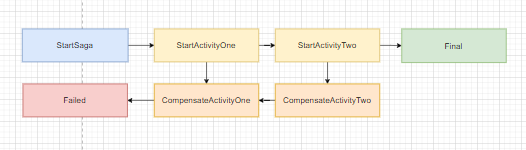
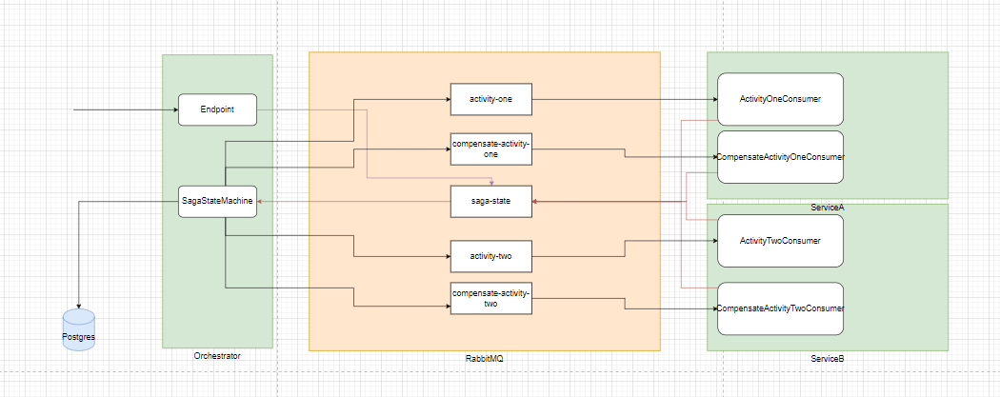

# SagaStateMachine

This [project](/SagaStateMachine) is an example implementation of a Saga State Machine that uses Masstransit, PostgreSQL and RabbitMQ.

## Pattern

https://learn.microsoft.com/en-us/azure/architecture/patterns/saga#orchestration

https://www.linkedin.com/pulse/saga-design-pattern-cnet-amir-doosti/

## Running the Application

The example is setup with Aspire. Running the Aspire host will start the following applications:

- Rabbitmq
- PostgreSQL
- Orchestrator
- ServiceA
- ServiceB

Calling the {Orchestrator}/start-saga endpoint will start a saga. From there the orchestrator will manage the saga state machine.
And the service's will execute the tasks until the saga is in a final state.

## Diagrams

### Flow

### Overview

